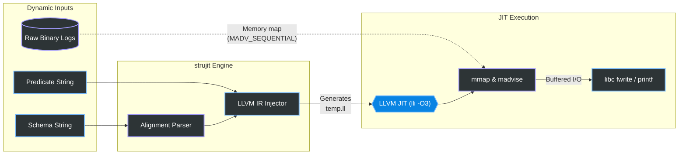

# strujit

<p align="center">
  
</p>

`strujit` is a dynamic binary stream filter for telemetry and event logs. It generates and JIT-compiles LLVM IR at runtime to process memory-mapped binary files, avoiding deserialization and reflection overhead.

## Motivation

When building generic CLI tools (like a binary equivalent of `jq` or `awk`) to filter logs of packed C-struct data, engineers typically rely on dynamic runtime parsing using tools like Python's `struct` module. While Python delegates the unpacking to C-extensions, executing interpreted queries in a tight loop over millions of records introduces measurable overhead.

## Design

`strujit` mitigates interpreter overhead by leveraging LLVM. Given a C-struct schema and a predicate string, it generates an LLVM IR template on the fly and executes it via the LLVM JIT (`lli`).



The generated IR maps the data to memory (`mmap`), hints the kernel for sequential prefetching (`madvise`), performs pointer arithmetic (`getelementptr`), evaluates the predicate natively, and buffers matching blocks to stdout via the C Standard Library (`fwrite` or `printf`). This approach eliminates AST execution in the hot loop.

## Benchmark

We measured `strujit` against a standard Python `struct.unpack` implementation over a 1.6 GB dataset of randomized 32-byte structs.

**Target:** Filter 50,000,000 structs for `size > 9900` and format the matching records into JSON strings. Output is piped to `/dev/null` to measure pure parser/JIT compute time without OS disk-write bottlenecks.

```bash
# Generate the 1.6 GB dataset
go run demo_generate.go

# 1. Python struct.unpack + json.dumps
time python3 demo_benchmark_json.py > /dev/null
# Result: ~3.36 seconds 

# 2. strujit JIT Pipeline (Native LLVM libc printf)
time ./strujit_bin "uint32 symbol, uint64 ts, float64 price, uint32 size" "size > 9900" ticks.bin --json > /dev/null
# Result: ~0.21 seconds 
```

**Conclusion:** By generating an LLVM template that hooks directly into the C Standard Library (`@printf`), `strujit` completes the entire End-to-End JSON pipeline over **15x faster** than a generic Python script. It parses the schema, injects the template, JIT-compiles to machine code, evaluates the predicate over 1.6 GB of mapped memory, and formats the output natively in a fifth of a second.

## Implementation Details

1. **Schema Parsing:** Converts `"uint32 symbol, uint64 ts"` into LLVM `<{ i32, [4 x i8], i64 }>` packed types, applying standard C ABI alignments.
2. **IR Generation:** Splices struct offsets and branch operators into a static LLVM IR `text/template`.
3. **JIT Execution:** Pipes the resulting unrolled logic to `lli -O3` for optimization and native execution.
